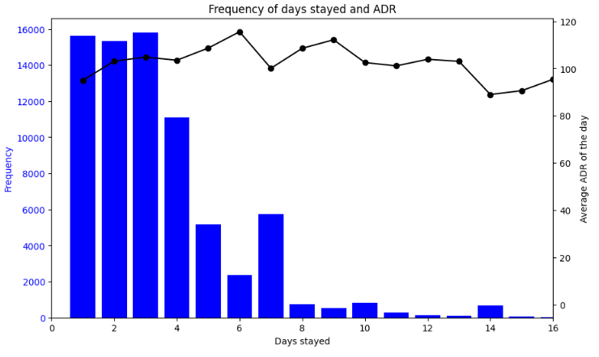

## Part 1: Understanding the Seasonality of Bookings

**Objective:** Analyze booking trends to create a dynamic pricing model that increases revenue during peak seasons.

**Findings:**

Analysis revealed distinct seasonal patterns in month and week of year, suggesting significant variations in booking volume. Daily fluctuations were less impactful. To streamline reservation management, the proposed seasonality strategy prioritizes week of year patterns.

**Price proposal:** 

1. Peak season (red): 17 to 21 (5 weeks)
* Highest Prices: Apply the highest price increases during this period.
* Consider Packages: Offer exclusive packages that bundle amenities or experiences to enhance perceived value.
* Minimum Stay Requirements: Implement minimum stay requirements during peak weekends to maximize occupancy.
2. High Season (Orange): 13 to 16, 22 to 26, 39 to 42(13 weeks) 
* Premium Pricing: Utilize a premium pricing model, charging higher rates than shoulder season but lower than peak season.
* Targeted Promotions: Offer special rates or packages for specific guest segments (e.g., families, couples).
* Early Bird Discounts: Encourage bookings further in advance with discounted rates.
3. Shoulder Season (Blue):7 to 12 and 27 to 38, 43 to 49 (25 weeks) 
* Discount Pricing: Offer discounts to attract guests during this period.
* Special Packages: Create packages that highlight activities or experiences available during the shoulder seasons.
* Weekday Specials: Incentivize midweek travel with lower rates.
4. Low Season (Gray):1 to 6 and 50 to 53 (10 weeks
* Deep Discounts: Apply significant discounts to attract budget-conscious travelers.
* Stay Longer, Save More" Deals: Encourage longer stays with progressive discounts based on the length of stay.
* Focus on Domestic Travelers: Target local and regional travelers seeking affordable getaways.

**Additional analysis by location, hotel type, or market segment could offer a more granular view of seasonality patterns, potentially leading to a more tailored strategy. However, this added complexity may require more sophisticated management.**

## Part 2: Understanding the Seasonality of Bookings

**Objective:** Understand customer stay duration to create attractive package options for different lengths of stay.

**Findings:**

Scenarios for Package Decisions: **5, 9 and 15 days**

1. When a Package is Not Attractive:
* Higher Prices for Extended Stays:
  If the price for an additional day (D+1) is significantly higher than the current day (D+0), it is not attractive to offer a package for the extended stay.
  Example: If the price for a 7-day stay is much higher than for a 6-day stay, it doesn't make sense to create a package for the 7th day.
Frequent Stays without Price Sensitivity:

* If the price for D+1 is equal to or lower than D+0, but stays of D+1 are more frequent than D+0, price is not a significant factor for extending the stay.
  Example: Even if the price for a 7-day stay is significantly lower than a 6-day stay, if 6-day stays are already popular, reducing the price for the 7th day won't attract many additional customers.

2. When a Package is Attractive:
* Lower Prices for Extended Stays with Less Frequent Occurrence:
If the price for an additional day (D+1) is lower than the current day (D+0) and stays of D+1 are less frequent than D+0, offering a package could be beneficial.
Example: Reducing the price for a 15-day stay might encourage customers who book for 14 days to extend their stay by an additional day.

* Equal or Slightly Higher Prices for Less Frequent Extended Stays:
If the price for D+1 is equal to or only slightly higher than D+0, and stays of D+1 are significantly less frequent than D+0, a discounted package might be appealing.
Example: Offering a discount for a 5-day stay might decrease revenue from existing 4-day stays, but this could be offset by the increased revenue from customers extending their stays from 4 to 5 days.

## Part 3: Comprehending the Cancellation Foundations

**Objective:** Establish a cancellation policy to minimize cancellation losses.

**Assumption:**

Cancelation Leadtimes and policy: To simplify our policy, we will use multiples of 30 days for cancellation lead times, with the exception of the first penalty period, which will apply closer to the booked date. This approach uses the following:
* 30 days and 150 days as key reference points, aligning closely with the beginning of the first and third quarters.
* The proximity of the arrival date to the booking date significantly reduces the likelihood of securing replacement bookings. Consequently, the first penalty period will be established for bookings made less than 30 days in advance.

**Proposal:**

1. 0 - 3 days: 90% (after 3 days, cancelations decrease)
2. 3 - 30 days: 75% (nearly 35% of all cancelations)
3. 31 - 60 days: 50% (nearly 50% of all cancelations)
4. 61 - 150 days: 25% (nearly 80% of all cancelation)
5. 151 days or more : 0%

## Part 4: Preparing the IT Systems for Demand

**Objective:** Identify peak demand periods to ensure sufficient IT resources are available.

**Assumption:**

Our data only includes arrival dates from July 1, 2015, to August 31, 2017. However, booking dates can extend beyond this range. For instance, we have bookings as early as June 24, 2013, indicating that bookings made in 2013 and 2014 with arrivals before 2015 might be missing. Similarly, bookings made in 2017 for arrivals in 2018 are also likely absent. To address this data gap, we'll filter our analysis based on a calculated range of booking dates.

* Start Date: July 1, 2015 (matching the earliest arrival date).
* End Date: July 31, 2016. We've determined that 95% of bookings have a lead time of 373 days or less. This means there's a high probability that bookings made within 373 days before the latest arrival date (August 31, 2017), which is August 23, 2016, are included in our data. Bookings with longer lead times are considered outliers and will have minimal impact on our analysis. To ensure we have full months, we'll use July 31, 2016, as our end date.

**Findings:**

* The data reveals significant peaks in bookings during the first six weeks of the year with a maximum of 2,066 bookings observed at the highest point (first week).

 

